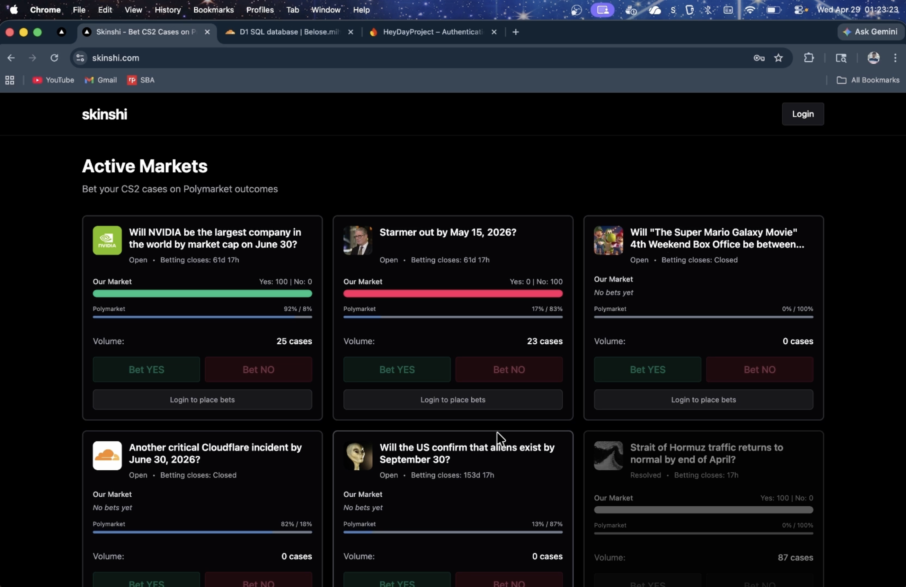
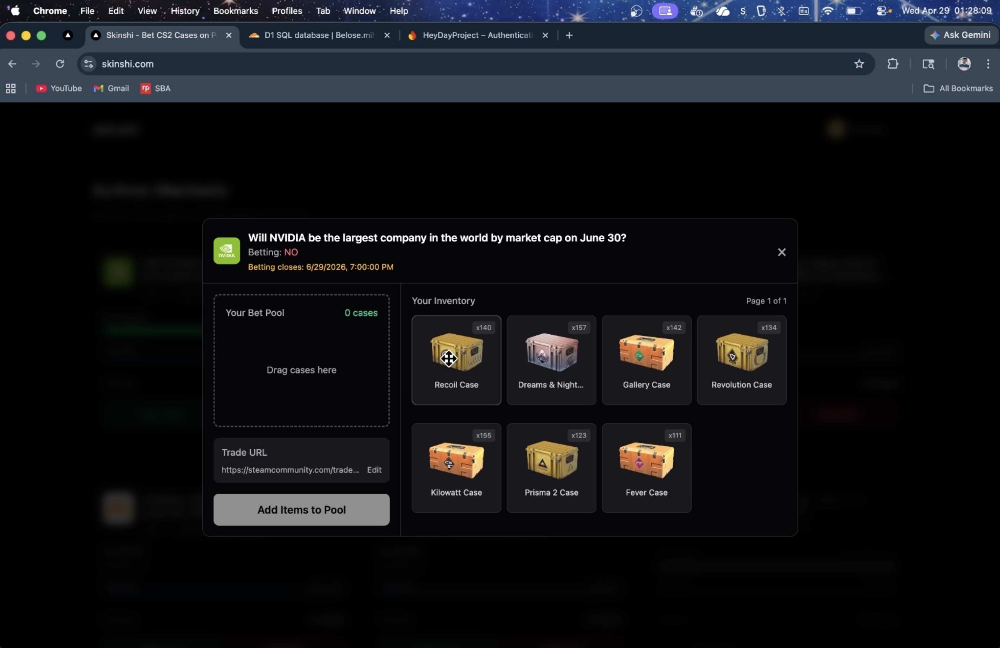

# Skinshi

Skinshi is a CS2-case betting platform built around real-world prediction markets. Users authenticate with Firebase, link a Steam account, browse locally enabled Polymarket markets, and place bets using tradable CS2 cases from their Steam inventory.

The system is split into a Vercel-hosted frontend, a Cloudflare Worker backend, shared TypeScript API code, and two Bun services running on a Raspberry Pi behind Cloudflare Tunnel.

## User Flows

### Market Home

Shows locally enabled Polymarket markets with Skinshi case pools and betting state.



### Placing a Bet

A Steam-linked user chooses an outcome, selects CS2 cases from their inventory, and submits a Steam trade URL. The backend creates the Steam trade offer and records the bet against the selected market.



## Architecture

```text
Browser / Next.js on Vercel
  -> /api/trpc
  -> Next.js tRPC proxy
  -> Cloudflare Worker
  -> @skinshi/api tRPC router
  -> Cloudflare D1 + Cloudflare KV
  -> Raspberry Pi services through cloudflared tunnels
     -> Steam service
     -> Polymarket service

Expo mobile app
  -> Cloudflare Worker /trpc
  -> same @skinshi/api tRPC router
```

The Cloudflare Worker is the backend boundary. The web app and mobile app do not call the Steam or Polymarket services directly. Clients talk to the Worker over tRPC, and the Worker runs the shared `@skinshi/api` router.

The Raspberry Pi services handle external integrations that do not belong inside the Worker runtime: Steam bot sessions, Steam trade offers, inventory fetching, Redis-backed caching, and Polymarket market fetching. They are exposed to the Worker through Cloudflare Tunnel.

## Monorepo Layout

```text
app/web                     Next.js web app deployed on Vercel
app/mobile                  Expo / React Native mobile app
workers/auth                Cloudflare Worker backend and tRPC gateway
packages/api                Shared tRPC router, schemas, DB access, business logic
packages/utils              Shared utilities used by apps
packages/eslint-config      Shared ESLint config
packages/typescript-config  Shared TypeScript config
services/steam              Bun service for Steam profile, inventory, and trades
services/polymarket         Bun service for Polymarket market data
```

This is a `pnpm` workspace managed with Turbo. Workspace packages are imported directly by the apps and Worker, so the tRPC types, schemas, and router stay shared across the stack.

## Deployment

### Frontend

`app/web` is deployed on Vercel. It is a Next.js app using the App Router, React, tRPC, TanStack Query, Firebase Auth, and Tailwind.

Browser tRPC requests go to the same-origin route `/api/trpc`. That route is implemented by `app/web/src/app/api/trpc/[trpc]/route.ts` and forwards requests to the Cloudflare Worker configured by `AUTH_WORKER_URL`. This keeps browser traffic same-origin while still using the Worker as the real backend.

### Backend

`workers/auth` is deployed as a Cloudflare Worker. It uses Hono for routing, mounts tRPC with `@hono/trpc-server`, and executes the `@skinshi/api` router.

The Worker owns the backend request lifecycle: verify Firebase tokens, build tRPC context, connect to D1/KV bindings, handle Steam OpenID callbacks, and call the tunneled Raspberry Pi services.

Cloudflare resources used by the Worker:

- D1 for persistent Skinshi app state
- KV for short-lived Steam OpenID state and Firebase key caching

### Raspberry Pi Services

`services/steam` and `services/polymarket` run as Bun services on a Raspberry Pi. The Worker reaches them through Cloudflare Tunnel using service URLs configured in `workers/auth/wrangler.jsonc`.

The services are not part of the public client API. They sit behind the Worker and do focused integration work for Steam and Polymarket.

## Request Flow

Web requests flow through Vercel first:

```text
User opens skinshi.com
  -> Vercel serves app/web
  -> Firebase handles browser auth
  -> tRPC request goes to /api/trpc
  -> Next.js proxies to the Cloudflare Worker
  -> Worker verifies auth and runs @skinshi/api
```

Mobile requests go directly to the Worker:

```text
User opens Expo app
  -> Firebase handles device auth
  -> tRPC request goes to the Cloudflare Worker /trpc endpoint
  -> Worker verifies auth and runs @skinshi/api
```

Backend service calls happen inside `@skinshi/api`:

```text
@skinshi/api router
  -> reads/writes D1 for users, markets, and bets
  -> uses KV for Steam OpenID state and Firebase key cache
  -> calls Steam service for Steam profile, inventory, and trade offer creation
  -> calls Polymarket service for live market metadata
```

## Authentication

Firebase is the primary app authentication system. Users log in from the web or mobile app, and the frontend sends the Firebase ID token with tRPC requests.

The Worker verifies the token before tRPC runs. After verification, it looks up the linked Skinshi user in D1 by Firebase email. A Firebase user can exist without a linked Steam account; Steam-linked procedures require a matching D1 user row.

Steam linking uses Steam OpenID:

```text
Frontend calls steam.initiate
  -> Worker creates short-lived state in KV
  -> user is redirected to Steam OpenID
  -> Steam redirects back to /auth/steam/callback
  -> Worker verifies the Steam response
  -> Worker inserts the Firebase-to-Steam link into D1
```

The Steam bot used for trades is separate from user Steam linking. The Steam service loads bot credentials from its service environment, maintains the bot session, and confirms trade offers.

## Data Model

Cloudflare D1 stores Skinshi's application state.

Core tables:

- `users`: links a Firebase account to a Steam ID
- `markets`: stores the locally enabled Polymarket markets and Skinshi pool state
- `bets`: stores user bets, selected outcome, buy-in items, payout data, and status

Polymarket is not the source of Skinshi user state. It provides external market metadata: question text, market status, end date, prices, and resolution information. Skinshi stores its own enabled market list, bet records, and CS2-case pool totals in D1.

## Shared API Package

`packages/api` is the center of the backend architecture. It defines the tRPC router used by the Worker and the clients' TypeScript types.

It contains the router composition, protected procedure middleware, Zod schemas, Drizzle schema, D1 helpers, service clients, and business logic for markets, bets, payouts, Steam linking, and admin operations.

The Worker imports and mounts this package. The web and mobile apps import its router type and schemas, giving the clients end-to-end typed API calls without duplicating contracts.

## Steam Service

`services/steam` is a Bun service responsible for Steam-specific work: bot authentication, session cookies, profile lookup, inventory lookup, CS2 case filtering, trade offer creation, payout trades, and mobile confirmation for bot trades.

It uses Redis for service-side caching and Steam libraries for session/trade management. The API package calls this service when it needs profile data, inventory data, or a Steam trade offer to be created.

## Polymarket Service

`services/polymarket` is a Bun service responsible for fetching and normalizing Polymarket data.

It calls the Polymarket Gamma API, extracts the market data Skinshi needs, normalizes resolution state, and caches responses in Redis. The API package calls this service when listing markets, loading a single market, or validating an admin-added market.

## Betting Flow

```text
User selects a market and outcome
  -> frontend loads linked Steam inventory through tRPC
  -> user selects CS2 cases and submits a trade URL
  -> @skinshi/api validates the bet request
  -> Steam service creates a trade offer requesting the selected cases
  -> D1 records the bet and updates the market pool after offer creation succeeds
```

When a market resolves, Skinshi records the outcome in D1. Winning bets can be paid out through the Steam service, which sends cases from the bot inventory back to the user's trade URL.

## Tech Stack

```text
Monorepo     pnpm workspaces, Turbo, TypeScript
Web          Next.js, React, tRPC, TanStack Query, Firebase Auth, Tailwind
Mobile       Expo, React Native, Expo Router, NativeWind, Firebase Auth, tRPC
Backend      Cloudflare Workers, Hono, tRPC, Drizzle, D1, KV
Services     Bun, Redis, Steam libraries, Polymarket Gamma API
Deployment   Vercel, Cloudflare Workers, Cloudflare Tunnel, Raspberry Pi
```

## Local Development

Run commands from the package directory you are working in.

Common local ports:

```text
app/web                 3000
workers/auth            8000
services/steam          8001
services/polymarket     8002
```

Examples:

```bash
cd app/web && pnpm dev
cd workers/auth && pnpm dev
cd services/steam && bun run src/index.ts
cd services/polymarket && bun run src/index.ts
```

For local development, the Worker config points at local service URLs. In production, the Worker points at the Cloudflare Tunnel service domains.
